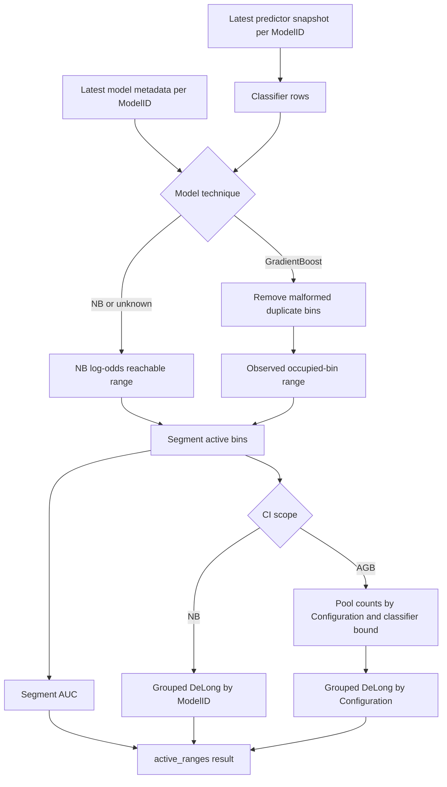

# AGB Active-Range AUC and Confidence Intervals

**Status:** Implemented design
**Updated:** August 26, 2026
**Primary API:** `ADMDatamart.active_ranges()`

This document defines the data-science contract for active classifier ranges,
AUC reference values, and confidence intervals for Adaptive Gradient Boosting
(AGB). It explains where AGB must differ from Naive Bayes (NB), which
uncertainty is estimable from an ADM datamart export, and how consumers should
interpret the resulting columns.

## Problem

ADM predictor exports contain classifier bins with positive and negative
response counts. For NB, the reachable classifier range can be reconstructed
from the additive model:

1. calculate the minimum and maximum log odds for every active predictor;
2. add the classifier offset;
3. normalize the sum; and
4. map the resulting score interval to classifier-bin boundaries.

An AGB model is a tree ensemble. Its score is the sum of tree contributions,
not the average of predictor-bin log odds. Applying the NB reconstruction to
AGB data therefore produces a range with no valid model interpretation.

AGB introduces a second distinction. One fitted ensemble is shared by the
issue, group, action, and treatment segments within a model configuration.
Treating each segment's AUC interval as an independent model interval
duplicates evidence and ignores the common fitted model.

## Goals and Non-Goals

### Goals

- Preserve the established NB active-range and AUC behavior.
- Derive an AGB range without using NB predictor arithmetic.
- Produce one conditional AGB confidence interval per configuration.
- Keep segment-level AUC values available for diagnostics.
- Make the confidence-interval scope and uncertainty boundary explicit.
- Remain robust to malformed duplicate AGB classifier rows that differ only
  in `BinIndex`.

### Non-goals

- Reconstruct all reachable tree-ensemble scores from the serialized AGB
  model.
- Estimate uncertainty caused by fitting the tree ensemble.
- Claim that binned counts recover row-level prediction information.
- Treat issue/group/action segments from one configuration as independent
  fitted models.

## Statistical Estimands

The API exposes two related AGB quantities.

### Segment active-range AUC

`AUC_ActiveRange` is calculated separately for each `ModelID` from that
segment's occupied classifier range. It describes observed discrimination in
the segment and remains useful when comparing segment behavior.

### Configuration conditional AUC and interval

`AUC_ActiveRange_CI_Estimate` is calculated after pooling classifier-bin
counts across all selected `ModelID` values in the same `Configuration`. Its
confidence interval describes validation-sample uncertainty for the shared
configuration, conditional on the already-fitted ensemble.

Consequently, an AGB row can have:

```text
AUC_ActiveRange != AUC_ActiveRange_CI_Estimate
```

This is intentional. The former is segment-level; the latter is the center of
the configuration-level interval. Consumers must compare confidence bounds
with `AUC_ActiveRange_CI_Estimate`, not assume they are centered on the
segment AUC.

## High-Level Data Flow



## Active-Range Definition

### Naive Bayes

NB continues to use the reconstructed minimum and maximum additive score.
Unknown model techniques retain this behavior for backward compatibility with
exports created before `ModelTechnique` was available.

### AGB

For AGB, a classifier bin is occupied when:

```text
BinPositives + BinNegatives > 0
```

The active interval starts at the first occupied bin and ends immediately
after the last occupied bin. Empty bins between those endpoints remain in the
range because they lie inside an empirically reached score interval. Empty
leading and trailing bins are excluded.

This definition is empirical, not structural. It answers "which score region
was observed in this validation data?" It does not prove that unoccupied
scores are unreachable by the tree ensemble.

## Grouped-Bin AUC and DeLong Variance

For score bin \(k\), let \(p_k\) and \(n_k\) be positive and negative counts,
and let \(P=\sum_k p_k\), \(N=\sum_k n_k\). Positives and negatives in the same
bin are treated as tied scores and receive the corresponding midrank
contribution.

The grouped implementation computes the same pairwise AUC quantity that would
result from expanding each bin into repeated tied observations. Its DeLong
variance is:

```text
Var(AUC) = Var(V10) / P + Var(V01) / N
```

where the `V10` and `V01` sample variances are weighted by the positive and
negative bin counts. A normal approximation supplies the requested two-sided
confidence bounds. Bounds are clipped to `[0, 1]`; separate safe-range columns
apply Pega's reflected `0.5`-to-`1.0` display convention.

At least two positives and two negatives are required at the interval's
actual scope.

## Why AGB Counts Are Pooled by Configuration

All segments in an AGB configuration use one fitted ensemble. Pooling their
validation counts:

- yields one reference estimate for the shared classifier;
- prevents one interval from being counted repeatedly as independent
  evidence; and
- increases effective validation volume without pretending that the fits are
  distinct.

Bins are pooled by configuration and classifier bound before the grouped AUC
calculation. This preserves tied score regions while summing their class
counts.

The pooled interval is copied onto each returned segment row so existing
`ModelID`-based consumers remain compatible. The following columns make that
repetition explicit:

| Column | NB | AGB |
|---|---|---|
| `AUC_ActiveRange_CI_Scope` | `model` | `configuration` |
| `AUC_ActiveRange_CI_Estimate` | Model AUC | Pooled configuration AUC |
| `AUC_ActiveRange_CI_IncludesModelFitUncertainty` | `false` | `false` |

Portfolio summaries must deduplicate AGB rows by configuration before
counting intervals or aggregating interval widths.

## Model-Fit Uncertainty Boundary

The interval is conditional on the exported model. It does **not** include
variation that would arise if AGB were retrained on another sample.

A single datamart export contains one fitted ensemble and aggregated
validation counts. It does not contain the repeated fits, bootstrap
replicates, out-of-bag predictions, or row-level training data needed to
estimate fit uncertainty. No variance formula can recover that missing
information from classifier-bin counts alone.

An unconditional AGB interval requires a separate input contract, such as:

1. repeated model fits from bootstrap or cross-validation samples;
2. out-of-fold row-level predictions with fit identifiers; or
3. an externally estimated fit-variance/covariance component.

Until such data exists, the API reports
`AUC_ActiveRange_CI_IncludesModelFitUncertainty=false`. Consumers must not
describe these bounds as total model uncertainty.

## Data Quality and Failure Semantics

- AGB classifier rows identical in all analytical fields but differing in
  `BinIndex` are deduplicated before ranges, AUCs, or counts are calculated.
- NB rows are not deduplicated by this workaround.
- No occupied AGB bins produce `empty_active_range`.
- Fewer than two pooled positives or negatives produce
  `insufficient_class_volume`.
- A missing NB reconstructed score produces `missing_score_range`.
- Availability and reason are evaluated from counts at the same scope as the
  interval, so a low-volume AGB segment can still use a valid
  configuration-level interval.

## Validation Strategy

The implementation is validated with deterministic, exact-value tests:

1. Existing NB fixtures retain their historical indices and AUC values.
2. AGB processing excludes AGB rows from NB score reconstruction.
3. Empty leading AGB bins move the active lower index to the first occupied
   bin.
4. Pooled AGB AUC, variance, and bounds match the public grouped-bin helper.
5. Segments in one configuration receive identical interval estimates.
6. Duplicate AGB classifier rows leave the complete result unchanged.
7. A low-volume segment in a sufficiently large configuration has a
   consistent available interval and null failure reason.
8. Lazy and streaming Polars execution return the same values.

Future validation against row-level predictions should compare:

- binned AUC against exact row-level AUC;
- grouped DeLong variance against row-level DeLong variance; and
- coverage under repeated validation samples while holding the fit fixed.

That exercise validates binning approximation and conditional coverage. It
still cannot validate model-fit uncertainty without repeated fits.

## Alternatives Considered

### Reuse NB predictor-bin log odds

Rejected because AGB scoring is not additive in those quantities. The result
has no defensible tree-ensemble interpretation.

### Decode the tree ensemble and enumerate all reachable scores

Deferred. Exact enumeration can be combinatorial, depends on predictor-domain
constraints absent from the export, and still does not estimate model-fit
uncertainty. It has substantially higher implementation and runtime cost than
the current validation use case justifies.

### Compute one DeLong interval per segment

Rejected as the primary AGB interval. It treats applications of one fitted
ensemble as independent models and encourages downstream overcounting.
Segment AUC remains available as a diagnostic point estimate.

### Pool all AGB configurations

Rejected because different configurations represent different fitted models,
populations, and score scales. Pooling stops at `Configuration`.

## Risks, Value, and Cost

| Decision | Value | Risk | Mitigation / cost |
|---|---|---|---|
| Occupied-bin AGB range | Removes invalid NB arithmetic with low runtime cost | Unobserved but reachable tail scores are excluded | Name and document the range as empirical |
| Configuration pooling | Matches the shared-fit deployment unit | Segment heterogeneity is hidden in the interval center | Retain segment AUC and explicit CI estimate/scope |
| Conditional-only CI | Statistically identifiable from exported data | Users may overstate uncertainty coverage | Explicit boolean column and documentation |
| Duplicate-bin workaround | Prevents inflated counts and narrow/shifted intervals | Could remove legitimate exact duplicate analytical bins | Apply only to known AGB rows and preserve NB behavior |
| Lazy Polars pipeline | Scales to large datamarts without row expansion | Complex expressions can drift across engines | Streaming-equivalence and exact-value tests |

## Architecture Principle Alignment

- **Contextual design:** NB and AGB use technique-appropriate definitions
  rather than forcing one scoring model onto both.
- **API first:** existing `active_ranges()` rows remain keyed by `ModelID`;
  new scope, estimate, and uncertainty columns define the changed contract
  without hiding it.
- **Software as an investment:** the design delivers a defensible conditional
  interval from data already present in exports and explicitly defers the
  expensive repeated-fit solution until its required data is available.
- **Built-in resiliency:** data-quality defects and insufficient volume become
  explicit reason codes rather than silent numerical fallbacks.
- **Security and privacy:** all calculations use aggregate bin counts; no
  customer-level or row-level observations are introduced or persisted.
